# PCutSpeedCTRL Constant Speed Controller

<ul align="left">
    <li>It provides constant speed operation and remote control of single phase AC motor suitable for operation with 220 vac 50hz.</li>
    <li>When produced with BTA41 triac switching element, it provides usage up to 40 Ampere. In my initial tests I used a 1.2kW AC motor.</li>
    <li>The first version component cost was calculated as $3,075.</li>
    <li>Suitable for use with standard hand milling motors that are easily available on the world market.</li>
    <li>The mentioned milling motors are suitable for use in CNC machines.</li>
    <li>Any CNC controller can be connected directly and in isolation with a standard PWM output.</li>
    <li>This resource contains design and production files for hardware and firmware.</li>
    <li>PC Software used in the development process; KICAD 9 for Hardware, MOUNRIVER 2.1 IDE and C programming language were used for Firmware. OCTAVE was used to create look up tables for some mathematical equations.</li>
    <li> <a href="https://youtu.be/PU_BxYYPQiw ">Test Video Youtube Link</a>  </li>  
</ul>  

<table align="center" width=90%>
<tr>       
<td align="center">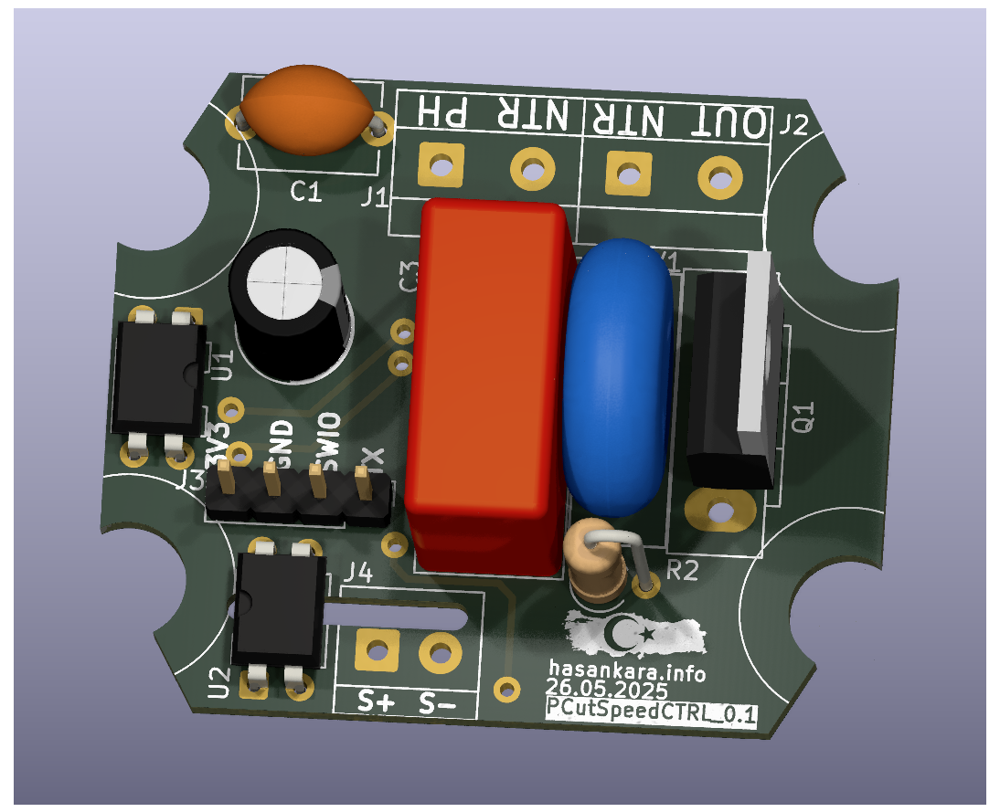</td>
<td align="center">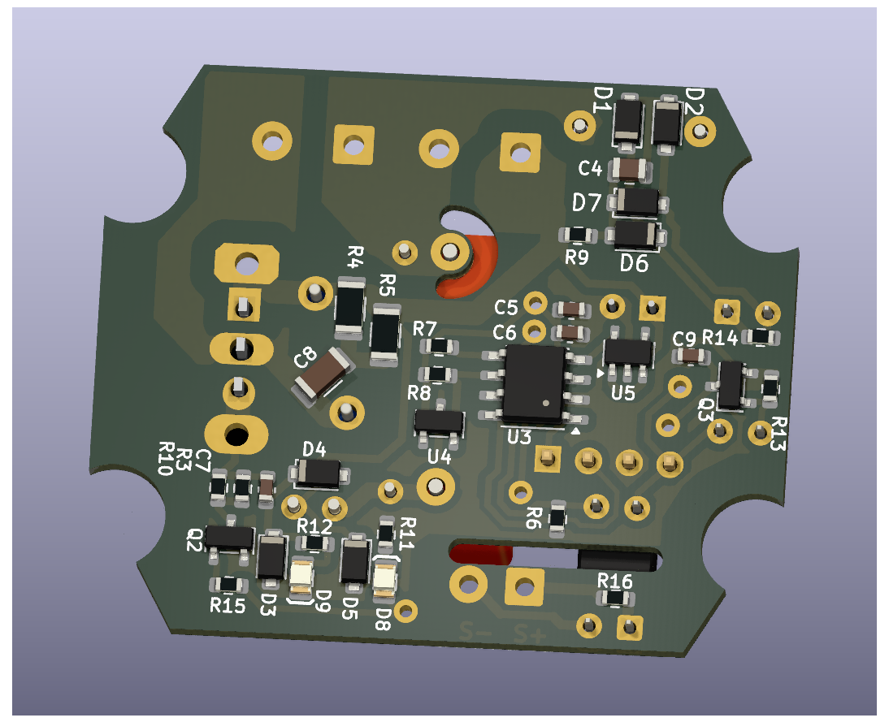</td>  
</tr>

<tr>  
<td align="center"> <b>3D Front</b></td>
<td align="center"> <b>3D Rear</b></td>
</tr>
</table>

## HARDWARE Detail:

### Schematic Detail:
<table align="center" width=90%>
    <tr>       
        <td style="width:70%">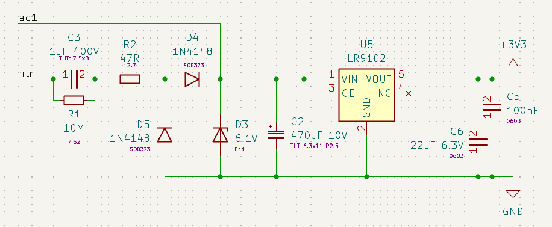</td>
        <td>
        Non Isolated Power Supply:
            <ul><i> 
                <li> A cost-effective, non-isolated design was implemented for low voltage supply needs.  </li> 
                <li> This scheme can meet the required 30mA power requirement. This power is mainly used for MCU operation, hall effect sensor operation and TRIAC triggering.</li> 
            </i></ul>
        </td>  
    </tr>
</table>

<table align="center" width=90%>
    <tr>       
        <td style="width:70%">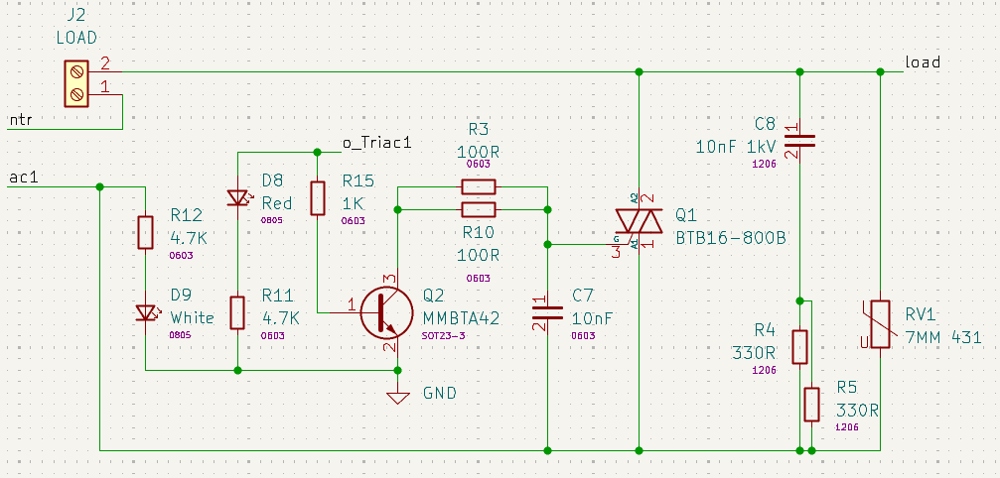</td>
        <td> 
        Triac gate drive circuit:
            <ul><i>
            <li>Phase cut topology used.</li> 
            <li> Some snubber components applied.</li> 
            </i></ul>
        </td>  
    </tr>
</table>
<table align="center" width=90%>
    <tr>       
        <td style="width:70%">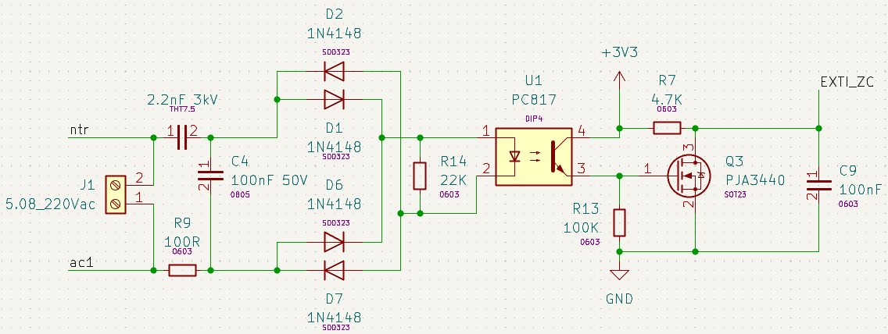</td>
        <td> 
        Zero cross detection circuit:
            <ul><i>
            <li>With q3 mosfet, a faster falling edge signal is generated.
            </li> 
            </i></ul>
        </td>  
    </tr>
</table>

<table align="center" width=90%>
    <tr>       
        <td style="width:70%">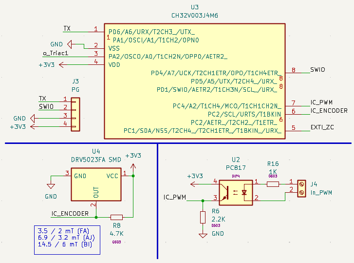</td>
        <td> 
        MCU, Hall Sensor and PWM Input Circuit:
            <ul><i>
            <li>It was developed using the ch32v003j4m6 microcontroller from wch company.</li>
            <li> DRV5023 hall sensor was used for spindle speed measurement.</li> 
            </i></ul>
        </td>  
    </tr>
</table>

### Panelize Detail:
<ul align="left">
    <li>We use the Kikit plugin for PCB paneling.</li>
    <li>We can panelize the PCB design by running the panelize_multiple.py file located in the "/HW/Panelize/" file path.</li>
    <li>Phase cut topology used.</li>
    <li>In panelized form, a new kicad project is created automatically.</li>
</ul>  

<table align="center" width=90%>
<tr>       
<td  style="width:65%">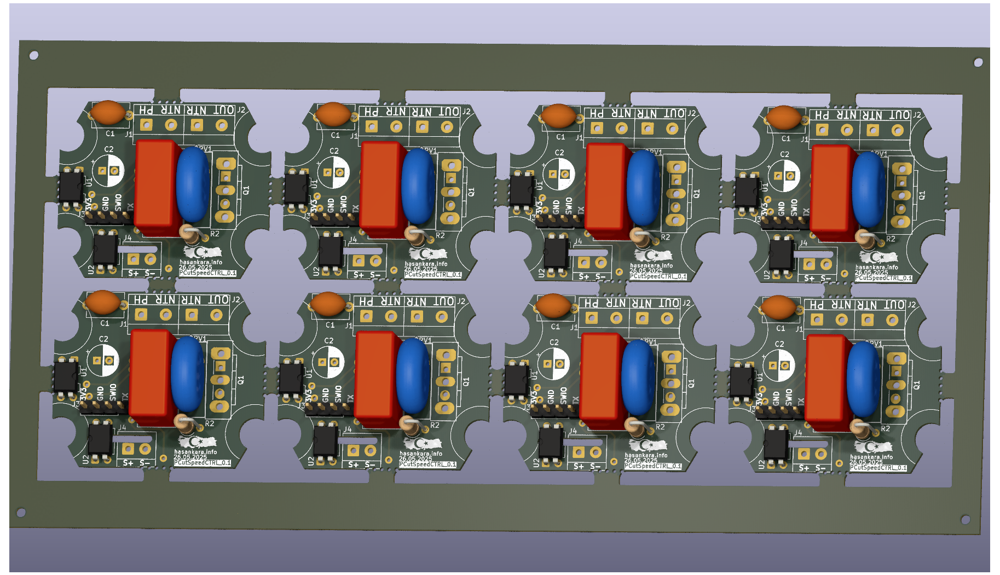</td>
<td>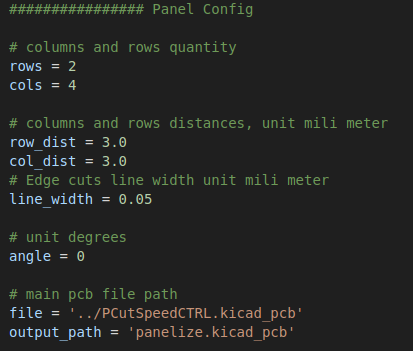</td>  
</tr>

<tr>  
<td align="center"> <b> Panelize Wiew </b> </td>
<td align="center"> <b> Some Panel Settings in panelize_multiple.py </b></td>
</tr>
</table>

## Mechanic Detail:
<ul align="left"> 
    <li> When the AC motor top cover is opened, 4 screw holes can be seen. 
    </li>
    <li> When the top cover of the spindle motor is first opened, there will be no hole in the middle 
    </li>
    <li> A metric 5 diameter hole should be drilled along the shaft, coinciding with the center.
    </li>
    <li> While designing the PCB, compatibility was ensured by using the Mac Allister manufacturer MSR1200 model AC motor. 
    </li>
</ul>

<table align="center" width=90% >
    <tr>       
        <td style="width:70%">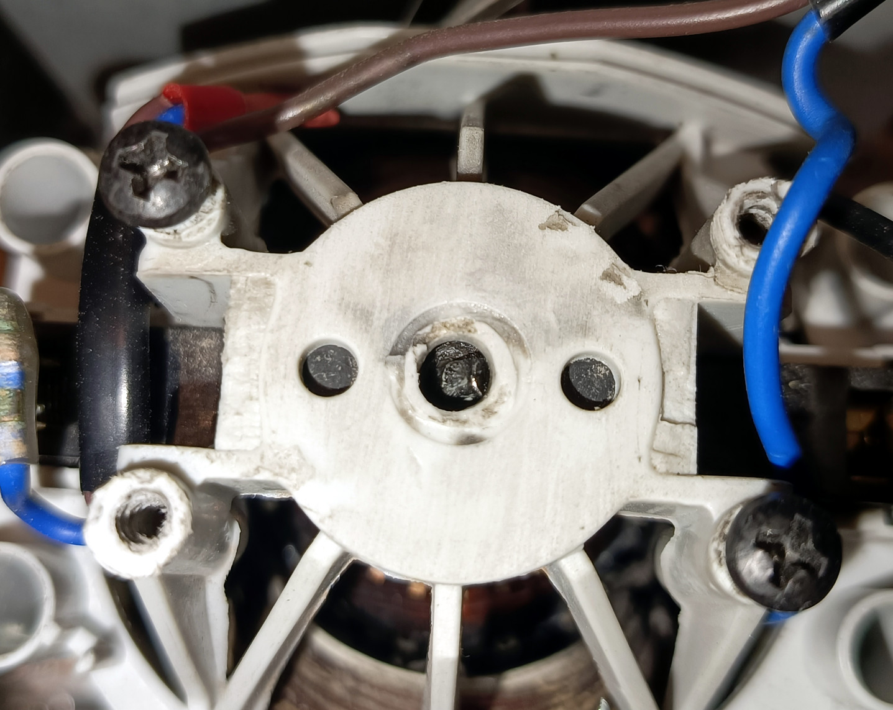</td>
        <td> 
            <ul>
                <li>
                    A 3x3 mm cylindrical neodymium magnet is inserted through this hole and coupled with the shaft.
                </li>
                <li>There should be an angle of approximately ~45° between the magnet cylinder center axis and the shaft axis. 
                </li>
                <li>The shaft and magnet can be attached using super glue.
                </li>
            </ul>
        </td>  
    </tr>
</table>

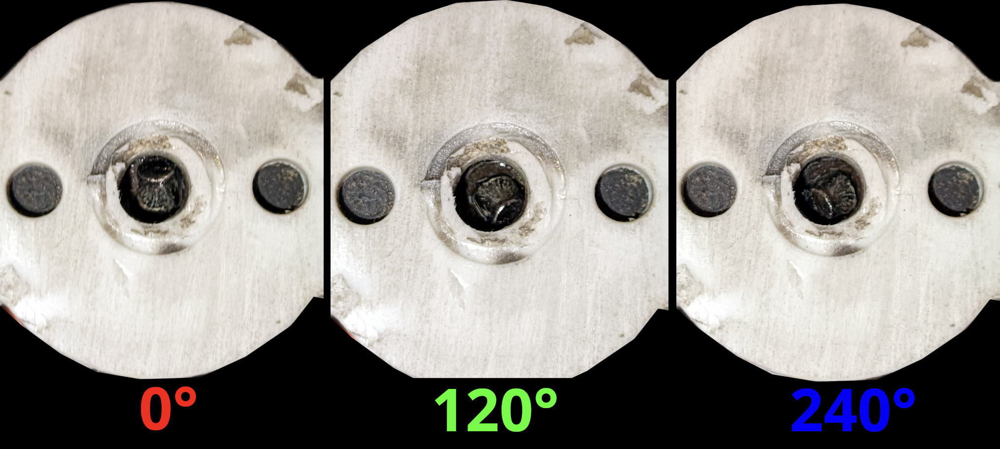

 <b> When the rotor is turned to different angles, it should be confirmed that the magnet rotates together. </b> 

<table align="center" width=90% >
    <tr>
        <td>  
            
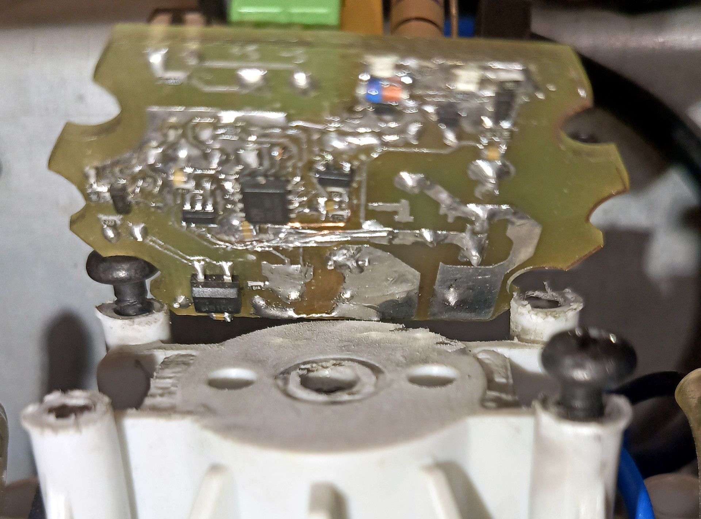

            
 <b> Spindle Motor Controller assembly demonstration </b> 

        </td>
        <td> 
            
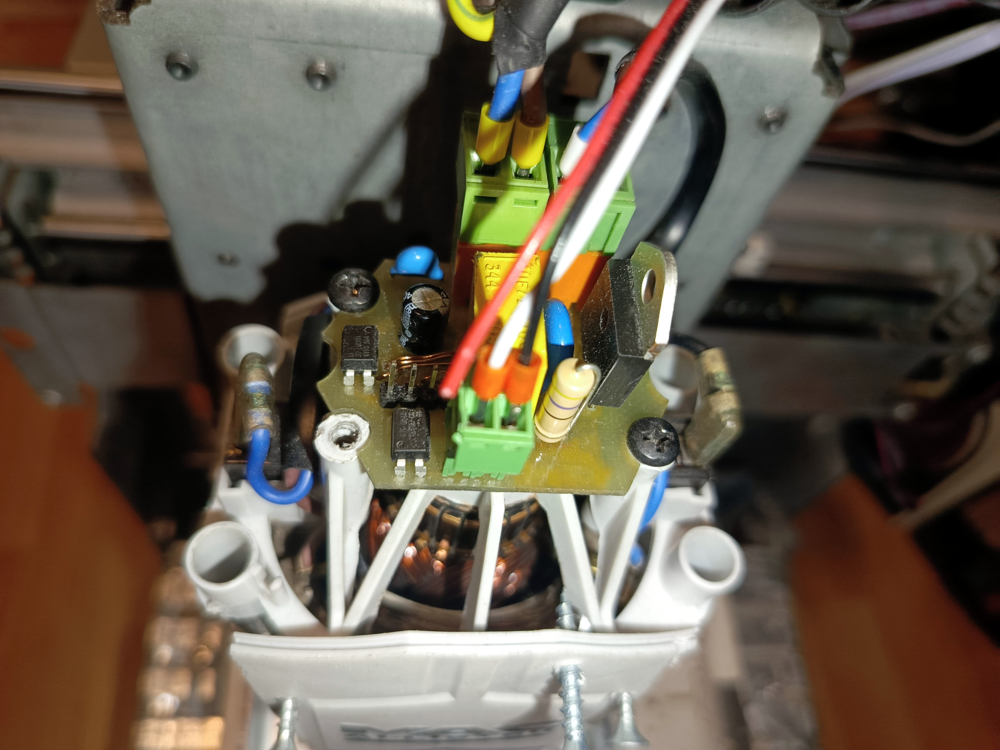

            
 <b> Spindle Motor Controller Driver Applied </b> 

        </td>
    </tr>
</table>

## Firmware Detail:

<ul align="left">
    <li>MOUNRIVER 2.1 IDE and C programming language were used for Firmware.</li>
    <li>The HYB cooperative operating system was used for the MCU resource management organization. </li>
    <li>Since the cooperative real-time operating system we use is very lightweight, it can easily adapt to the Microcontroller despite its weak memory.
    </li>
    <li> With this project, I am also sharing the cooperative operating system that I have been developing over the years as open source.</li>
    <li> I also added some libraries to the firmware that are not actively in use but could enable developments that fit the structure of the project.
    </li>
    <li>NTC temperature sensor data interpretation, ADC reading, moving average filter, some of them. 
    </li>
</ul>  

### About the main routine:
<ul align="left">
    <li>Using 2 different input capture modules, PWM input data was taken with IC1 and the magnetic sensor digital output frequency value was measured with IC2.</li>
    <li>Speed ​​change commands have been smoothed to create a ramp between the PWM data and the target speed information.</li>
    <li>Zero Cross detection was performed using the external interrupt module. Triac triggering and PID routines were run with each ZC detection.</li>
    <li>For linearization of the system, the source signal is assumed to be a sinusoidal signal. The equation used is the integral of the half sine signal.</li>
    <li>For system linearization, PID output information was applied to the linearization function using the look up table interpolation created with the Octave PC application.</li>
    <li>Thus, a more stable closed-loop system was obtained with fixed PID coefficients.
    </li>
    <li>Duty data was evaluated as time data to convert it into TRIAC switch signal.</li>
    <li>In addition to the look up table, a firmware setting option has been added to enable linearization by measurement method.
    </li>
    <li>The firmware can be made to work with different features with a set of predefined settings.</li>
    <li>The mentioned settings can be seen in the image below, as well as in the main.c file.</li>
</ul>  

<td >  
    
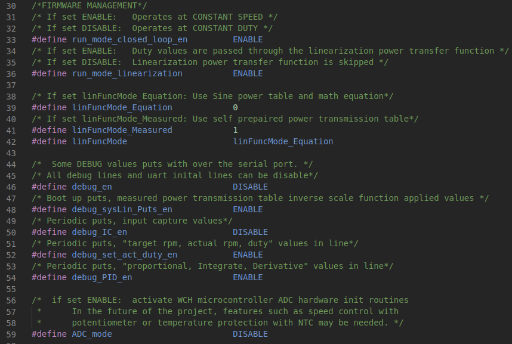

    
 <b> Firmware Managment Settings 1 </b> 

</td>

<td> 
    
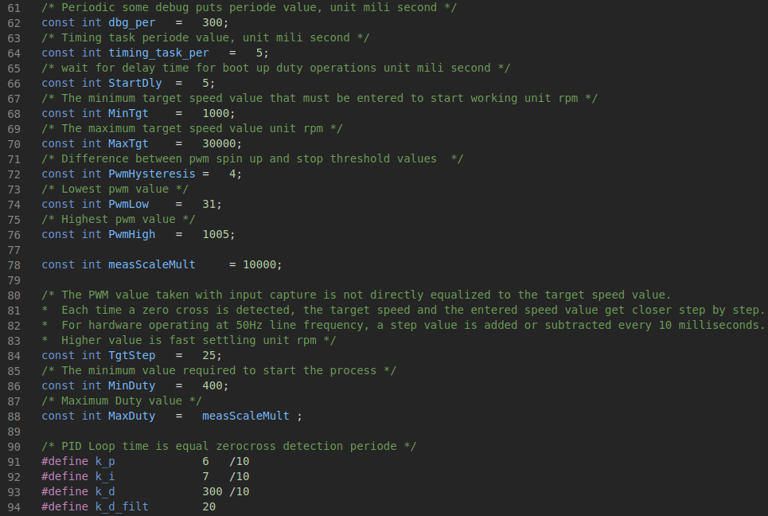

    
 <b> Firmware Managment Settings 2 </b> 

</td>

### Octave Equations Plot and Print :
<ul align="left">
    <li>The linearization table created with Octave PC software can be examined graphically and can be evaluated by copying and pasting directly into the C code.</li>
    <li>Similarly, the linearization table output from the MCU serial port output at boot up time can be directly copied and pasted into the Octave software and visually inspected. </li>
</ul>  

<table align="center" width=90% >
    <tr>
        <td>  
            
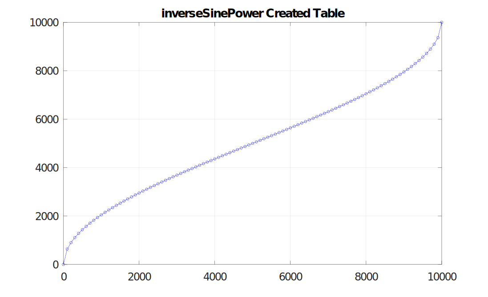

            
 <b> Inverse Sine Power Equation Created</b> 

        </td>
        <td> 
            
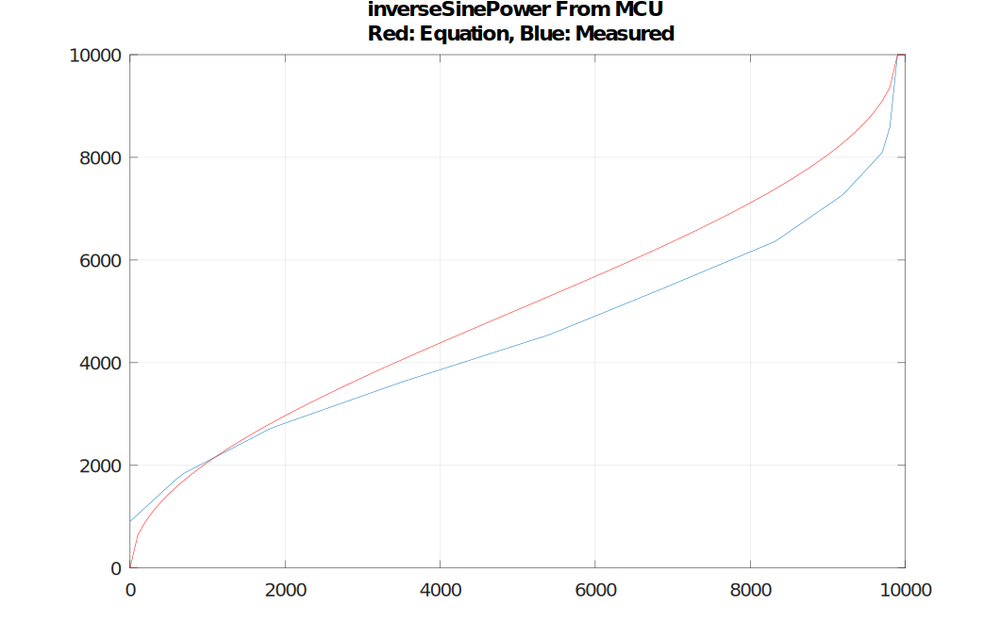

            
 <b> Inverse Sine Power from MCU, Equation and Measured </b> 

        </td>
    </tr>
</table>

## Some Tests:

<ul align="left">
    <li>As can be watched in the video link shared above, we performed some aluminum sheet and PCB drilling tests.</li>
    <li>When we apply sudden strain and sudden release tests, overshooting values ​​of up to 800 rpm occur.</li>
    <li>The spindle motor we tested has a 30k rpm feature at full power.</li>
    <li>As is known, keeping a constant speed at low rotational speeds can be a very challenging goal.</li>
    <li>Its ability to remain at low overshoot values ​​while at 1k rmp target speed is at a satisfactory level.
    </li>
    <li>We could observe that it does not work so stably unless linearization is applied.</li>
    <li>We made it possible to observe the result by disabling a single predefined setting via the firmware.</li>
</ul>  

<td >  
    
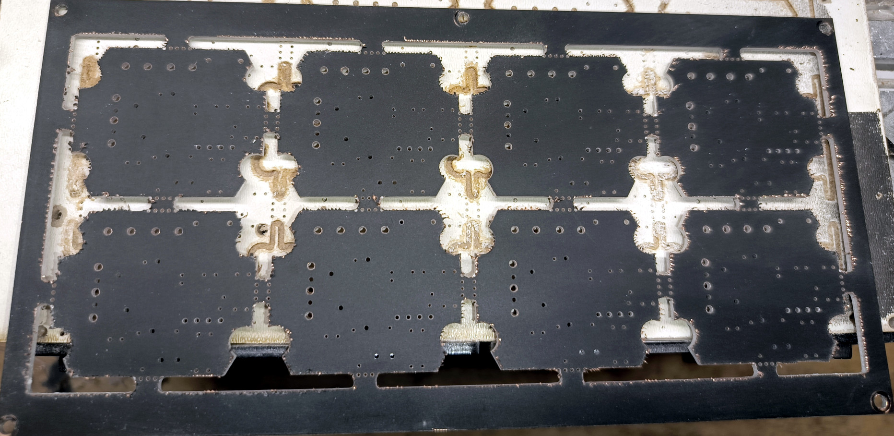

    
 <b> PCB Milling and Edge Cut Test Front </b> 

</td>

<td> 
    
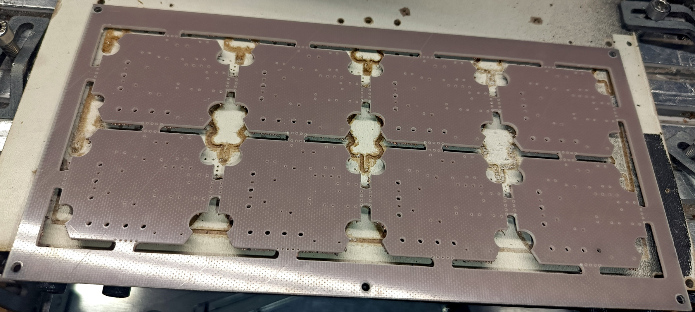

    
 <b> PCB Milling and Edge Cut Test Rear </b> 

</td>

## Production:
<ul align="left">
    <li> Gcode files created for PCB production with DIY techniques can be found in the HW/Panelize/Plot_diy folder.
    </li>
    <li>The bom list, along with supply links and unit prices, can be viewed in the "HW/bom" file path.</li>
    <li>For PCB fabrication files, files in the "HW/Plot" or "HW/Panelize/Plot" file path can be compressed and shared directly with the PCB manufacturer.</li>
</ul>  
